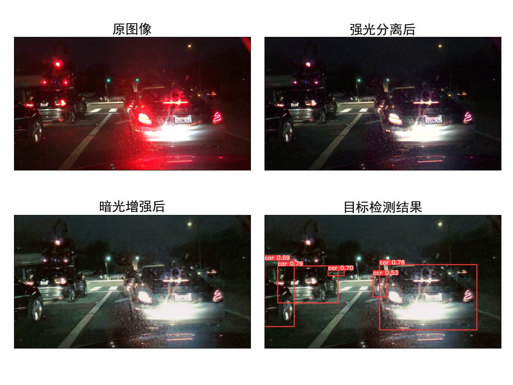
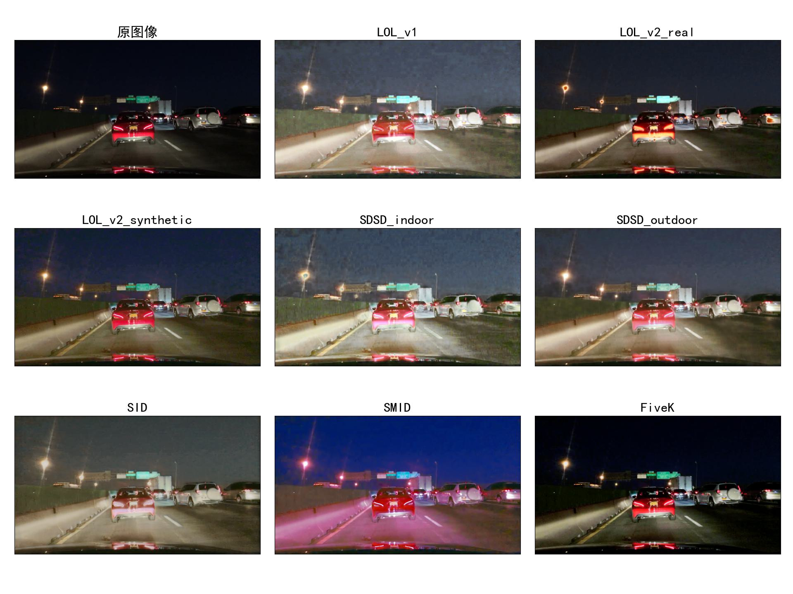
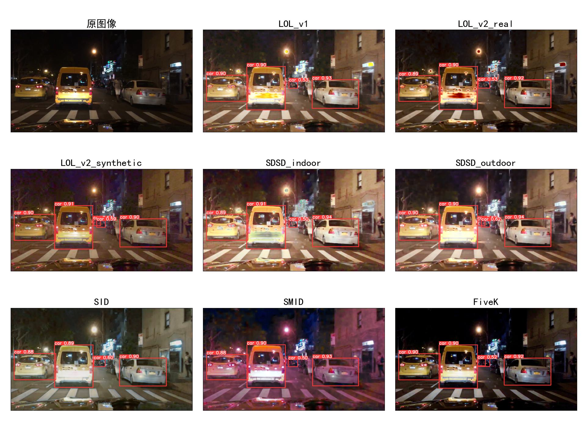

# 强光分离/暗光增强目标检测系统

HFUT 领域方向设计 & 毕设选题：
- 基于暗光增强的夜间车辆识别系统设计与实现
- 基于光照分量分离的暗光增强系统设计与实现

## 实现功能

- 对车灯、有色光晕的强光分离（主要针对车灯的散光，对于路灯和较强的光效果不明显）
- 选择不同模型对夜间及较暗环境图片进行暗光增强
- 选择不同模型对图像进行目标检测

部分效果展示：







## 项目环境

操作系统：Windows 11

编程工具：PyCharm Community / VSCode

训练平台：Google Colab

（项目没有在其他环境中测试，不保证其他平台能够运行）

## 初始化操作

通过 `requirements.txt` 文件安装必要包（没有测试效果，可能会有遗漏）

从 `ClearLightEffect/results/delighteffects/model/` 下的文件 `delighteffects_params_0600000.pt.txt` 中的链接，下载模型并移动到同路径，参考下面的文件结构。

确保文件结构如下（必要文件已列出）：

```
├─basicsr
├─basicsr.egg-info     
├─ClearLightEffects
│  │  dataset.py
│  │  ENHANCENET.py
│  │  main_delighteffects.py
│  │  networks.py
│  │  utils.py
│  ├─light-effects // 1.1 强光分离数据集的临时位置
│  ├─output // 1.2 强光分离结果的临时位置
│  └─results
│     └─delighteffects
│         └─model
│                 delighteffects_params_0600000.pt
│                 delighteffects_params_0600000.pt.txt
├─data
│  └─Test
│      └─input // 2.1 暗光增强数据的临时位置
├─Enhancement
│     test_from_dataset.py
│     test_my_dataset.py
│     utils.py   
├─input // 0 输入的测试集
├─object_test // 3.1 目标检测数据的临时位置
├─object_weights
│      car_day_40k.pt
│      yolov8n.pt     
├─Options
│      RetinexFormer_Test.yml
├─output // 4 最终结果存储的位置，文件夹名称为测试的时间戳
├─pretrained_weights
│      FiveK.pth
│      LOL_v1.pth
│      LOL_v2_real.pth
│      LOL_v2_synthetic.pth
│      SDSD_indoor.pth
│      SDSD_outdoor.pth
│      SID.pth
│      SMID.pth
├─results
│  └─Test
│      └─RetinexFormer_Test // 2.2 暗光增强的结果临时位置
└─runs
   └─detect // 3.2 目标检测的结果临时位置：runs/detect/predict
```

## 测试运行

运行 `main_ui.py` 文件，通过用户界面操作。

注：可以将文件直接拖入文件列表框中，然后选择测试参数后，点击运行按钮测试

测试的结果会以缩略图和相应文件夹下的大图的形式呈现，其中还包含有记录测试参数的文本文件。

每个输出结果文件夹（以时间戳为名称）的结构大致如下：

```
│     YYYY-MM-DD-hh-mm-ss.log.txt // 参数文件
│     xxxxxx.jpg // 测试的结果比对缩略图
│     ...
├─input // 输入原图
├─light_effects_clear    // 强光分离（如果有的话）后的大图结果
├─night_enhanced         // 弱光增强（如果有的话）后的大图结果
├─night_enhanced_compare // 不同增强模型的比对（如果勾选了）
│  │  xxxxxx.jpg // 比对缩略图
│  │  ...
│  ├─FiveK // 不同数据集的增强模型处理后的大图结果
│  ├─ ...
│  └─SMID
├─object_detected         // 目标检测（如果有的话）后的大图结果
└─object_detected_compare // 不同模型的目标检测比对（如果勾选了）
   │  xxxxxx.jpg // 比对缩略图
   │  ...
   ├─FiveK // 不同增强模型处理后的目标检测大图结果
   ├─ ...
   └─SMID
```

## 补充说明

目标检测模型（object_weights）的命名规则，如 `bdd_day40k20c.pt`：
- bdd 表示训练数据集来自 BDD 提供的数据集（同理 sc 表示 Stanford Cards）
  - 如果是 bddcar，则表示训练标签只有 car（没有 bus 和 truck）
  - 如果是 bddmix，则表示 car 和 bus / trunk 的标签混合了
- day 表示训练集的数据是白天还是夜晚（night）
  - 如果是夜晚，默认的暗光增强模型是 LOL_v1
- 40k 表示训练集的数量（不标即为默认值 10k）
- 20 表示训练的 epoch 数（不标即为默认值 10）
- c 表示模型是基于已训练好的模型进一步训练出来的（比如 20 个 epoch 的模型是在 10 epoch 模型的基础上继续训练而来，如果没有 c 则表示模型是一次性训练出来的）
- 如果后缀为 512，则表示是使用 512x512 的图片训练的，理论上只对 16:9 resize 到 1:1 的测试集有较好的效果，属于训练前期的失败模型

注：yolobv8n.pt 模型是 yolo 项目提供的最基础的 pretrained model

## 参考项目

整合了以下项目（其中第一个项目只使用到了强光分离的部分）：
- [jinyeying/night-enhancement: [ECCV2022] "Unsupervised Night Image Enhancement: When Layer Decomposition Meets Light-Effects Suppression", https://arxiv.org/abs/2207.10564](https://github.com/jinyeying/night-enhancement)
- [caiyuanhao1998/Retinexformer: "Retinexformer: One-stage Retinex-based Transformer for Low-light Image Enhancement" (ICCV 2023)](https://github.com/caiyuanhao1998/Retinexformer)
- [ultralytics/ultralytics: NEW - YOLOv8 🚀 in PyTorch > ONNX > OpenVINO > CoreML > TFLite](https://github.com/ultralytics/ultralytics)

注：本项目只保留了测试部分，训练部分请参考上述项目链接自行训练